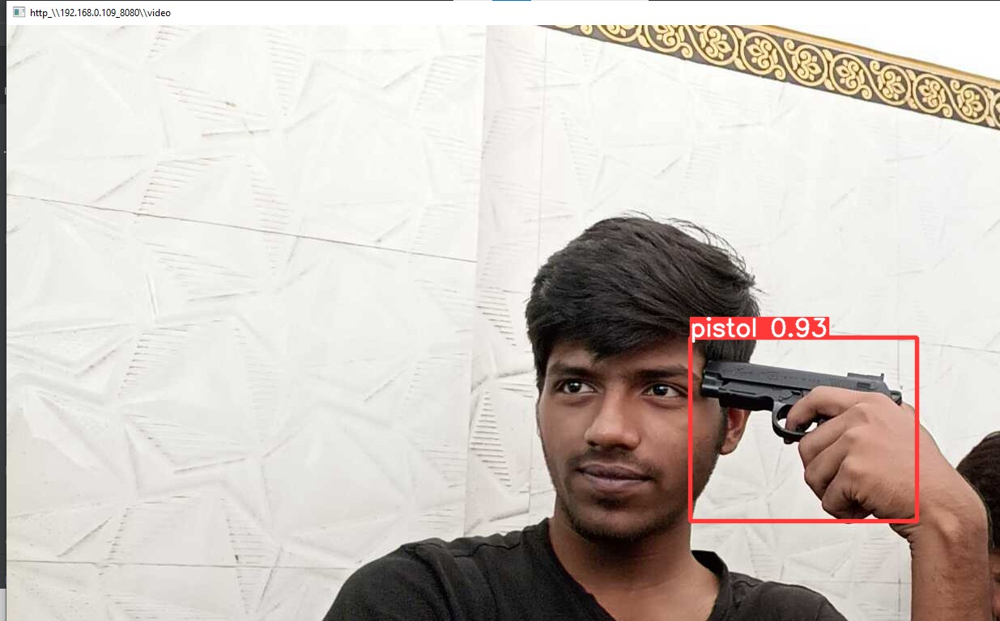

# 🔫 Weapon Detection with Email Alert System

An AI-powered real-time weapon detection system using YOLOv5 for CCTV footage, integrated with an automated email alert system to enhance surveillance and security.

---

## 📌 Overview

This project leverages **YOLOv5 (You Only Look Once)** for detecting weapons such as guns and knives from video streams. When a weapon is detected, the system **captures a frame** and sends an **email alert with the snapshot** to the concerned authority.

---

## 🎯 Features

- 🔍 Real-time object detection (YOLOv5)
- 📸 Snapshot capture of detected weapon
- 📧 Automated email alert with image attachment
- 🖥️ Works with both CCTV footage and webcam input
- 📈 Detection accuracy: ~90%

---

## 🧠 Tech Stack

| Category        | Technologies                         |
|----------------|--------------------------------------|
| Programming    | Python                               |
| Model          | YOLOv5 (PyTorch-based)               |
| Tools & Libs   | OpenCV, smtplib, email.mime, torch   |
| Deployment     | Flask/Docker                         |

---

## 📂 Project Structure

```
weapon-detection-email/
├── yolov5/                   # YOLOv5 cloned repo
├── weights/                  # Trained weights (.pt)
├── detect.py                 # Main detection + email script
├── utils/                    # Utility scripts (if needed)
├── email_alert.py            # Email sending function
├── requirements.txt
└── README.md
```

---

## ⚙️ Setup Instructions

1. **Clone the Repository**
```bash
git clone https://github.com/RusTeaZe2440/weapon-detection-email.git
cd weapon-detection-email
```

2. **Install Dependencies**
```bash
pip install -r requirements.txt
```

3. **Download YOLOv5 Weights**
- Use custom trained weights (`best.pt`) and place in `weights/` folder
- OR use pre-trained `yolov5s.pt` model

4. **Run the Detection Script**
```bash
python detect.py --source 0  # For webcam
```

---

## 🧪 Sample Output

When a weapon is detected:
- A bounding box is drawn around it
- An email is triggered with the image attached

[300,300] <!-- Replace with actual screenshot -->

---

## ✉️ Email Alert Configuration

Make sure to enable **“Less secure app access”** in your Gmail (or use App Password if 2FA is enabled).

In `email_alert.py`:
```python
SENDER_EMAIL = "your_email@gmail.com"
RECEIVER_EMAIL = "receiver_email@gmail.com"
PASSWORD = "your_email_password"
```

---

## 🧠 Future Improvements

- Deploy via Flask as a web app
- Integrate Twilio for SMS alerts
- Extend object detection to multi-class (knife, gun, suspicious items)

---

## 📄 License

This project is open-source.

---

## 🙋‍♂️ Author

**Bhavesh Kishor Bhalerao**  
📧 bhavesh.bhalerao25@gmail.com  
📍 Kalyan, Maharashtra  
🔗 [LinkedIn](https://www.linkedin.com/in/bhavesh-bhalerao-0958b4224)

---

## 🙌 Acknowledgements

- [YOLOv5 by Ultralytics](https://github.com/ultralytics/yolov5)
- [OpenCV](https://opencv.org/)
